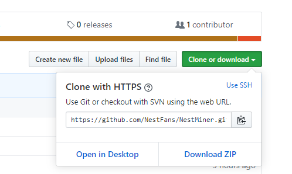
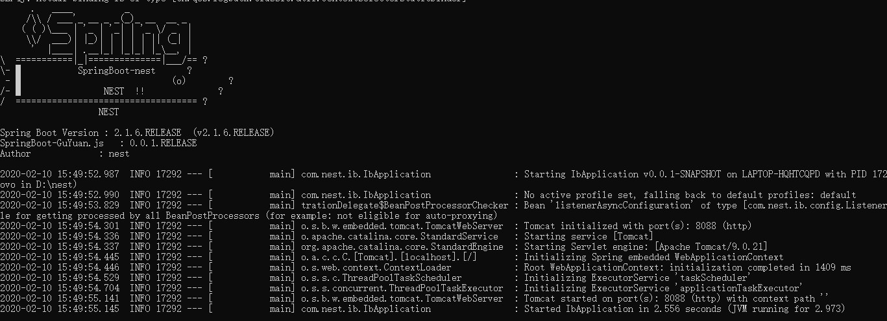
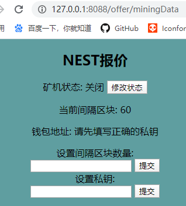

#### 自动报价操作步骤

1. 在github下载源码

   方式1： 
   	打开CMD使用命令：git clone  https://github.com/NestFans/NestMiner.git

   方式2：

   	进入：https://github.com/NestFans/NestMiner.git，点击Download ZIP下载后解压到D盘

   	

2. 找到start.bat文件，双击即可（会弹出一个窗口,不要关闭）。

   

4. 打开浏览器访问: http://127.0.0.1:8088/offer/miningData

   

5. 打开页面后,从下到上依次： 设置私钥 -> 设置间隔区块数量 -> 修改状态。

#### 注意事项

1. 由于获取的实时价格来源于火币交易所api,需要电脑开启VPN
2. 程序里面设置了一个默认节点, 如果使用的人数过多,达到节点访问上限,将无法使用.大家可以自己去 <https://infura.io/> 注册一个节点
